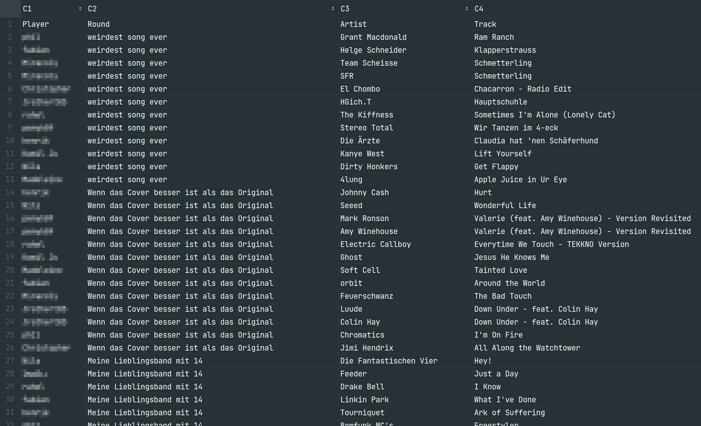
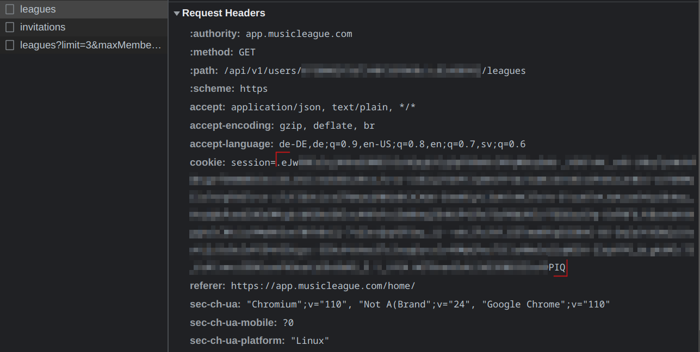
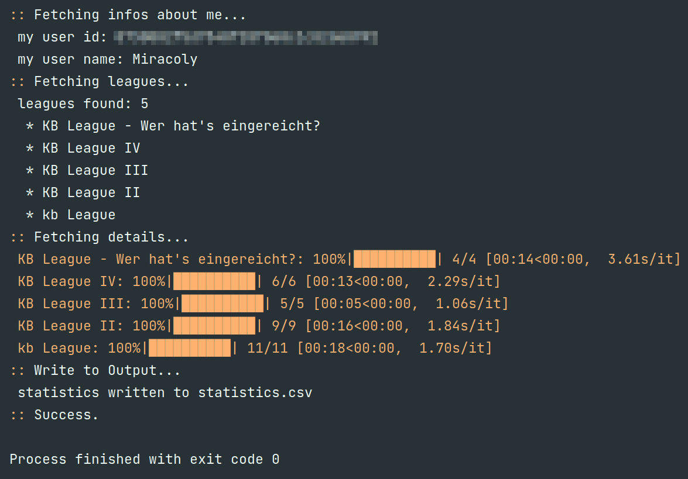

= Music League Statistics
:toc: macro

image:https://img.shields.io/github/pipenv/locked/python-version/miracoly/music-league-statistics[GitHub Pipenv locked Python version]

This script creates a summary of all played rounds on MusicLeague.

toc::[]

== Motivation
https://musicleague.com/[MusicLeague] is an awesome online game where you submit Spotify songs to different topics. Each player can then rate the songs. Whoever gets the most points wins.

*Guess Who:* After some normal rounds our group decided to play league where we have to guess, who submitted the song. This script helps to get a better profile about each player and helps decide, who might submit which song.

=== Result
The result is a table of all submitted songs per round and league by player.

== Installation
This script requires Python 3.11+ and uses https://pipenv.pypa.io/en/latest/install/#installing-pipenv[pipenv] to manage dependencies.

Clone this repository and `cd` into it.
To install all dependencies run:
[source,shell]
----
pipenv install
----

== Usage
=== Get your session id
To run the script, you need your session id from music league. You find it in the cookie header of every secured request to the music league website.

=== Run the script
To run the script, execute the following command:
[source,shell]
----
pipenv run python main.py --session ".eJw[...]PIQ"
----
The output looks like this:

=== Help
Type `python main.py -h` to print the help menu.

[source,shell]
----
$ python main.py -h
usage: main.py --session SESSION [--output OUTPUT] [-h]

Fetches all leagues of user and creates statistics.

options:
  --session SESSION  (str, required) Your session ID which is used for every
                     request to music league. You find it in the cookie
                     header. Use double quotes or no quotes at all.
  --output OUTPUT    (str, default=statistics.csv) Specify filename of CSV
                     output.
  -h, --help         show this help message and exit
----